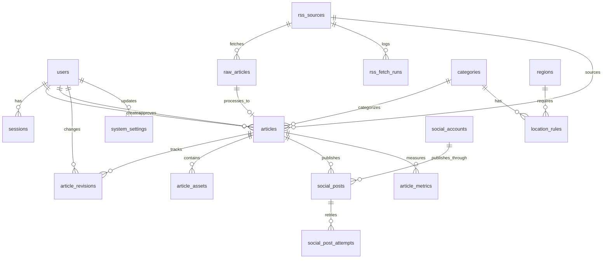

# TrakyaHaberBot - Veri Modeli ve Veritabanı Tasarımı

## İçindekiler
- [Veri Modeli Prensipleri](#veri-modeli-prensipleri)
- [Enum Tipleri](#enum-tipleri)
- [Ana Tablolar](#ana-tablolar)
  - [Kimlik ve Yönetim](#kimlik-ve-yönetim)
  - [İçerik ve Ingest](#i̇çerik-ve-ingest)
  - [Kural ve Konfigürasyon](#kural-ve-konfigürasyon)
  - [Kuyruk ve İşlem İzleme](#kuyruk-ve-i̇şlem-i̇zleme)
  - [Yayın ve Sosyal Medya](#yayın-ve-sosyal-medya)
  - [Analitik ve Metrikler](#analitik-ve-metrikler)
- [İlişkiler ve Foreign Keys](#i̇lişkiler-ve-foreign-keys)
- [İndeksler ve Performans](#i̇ndeksler-ve-performans)
- [Prisma Schema Örneği](#prisma-schema-örneği)
- [Seed Data Örnekleri](#seed-data-örnekleri)
- [Veri Yaşam Döngüsü Senaryoları](#veri-yaşam-döngüsü-senaryoları)

---

## Veri Modeli Prensipleri

### 1. DB-Driven Kural Motoru
Kategoriler, lokasyon filtreleri, moderasyon toggle'ları ve sosyal medya davranışları veritabanında yapılandırılabilir. Hardcoded business logic yerine tablolara dayalı esnek kural sistemi.

### 2. Haber İçerik Yaşam Döngüsü
Her haber şu state'lerden geçer:
```
fetched → classified → filtered_out (elenirse)
                    ↓
                rewritten → pending_review (moderation açıksa)
                         ↓
                     approved → published → social_pending → social_published
```

State machine veri modelinde `article_status` ve `publication_status` enum'larıyla yansıtılır.

### 3. Idempotency
RSS kaynaklardan aynı haberin tekrar çekilmesini engellemek için:
- `raw_articles` tablosunda `source_url_hash` unique index
- URL'den SHA256 hash oluşturulur ve duplicate kontrolü yapılır

### 4. Auditability
- Haber değişiklikleri `article_revisions` tablosunda tutulur
- İşlem hataları `processing_failures` tablosunda log'lanır
- Sosyal medya paylaşım denemeleri `social_post_attempts` tablosunda izlenir

### 5. Moderation ve Retry
- Haber moderation durumu `article_status` enum ile izlenir
- Başarısız işlemler retry count ve next_retry_at ile yönetilir
- Dead letter queue için `processing_failures` tablosu

### 6. Scheduling
- Sosyal medya paylaşımları `scheduled_for` timestamp ile planlanabilir
- BullMQ delayed jobs ile tetiklenir

---

## Enum Tipleri

### `user_role`
Kullanıcı yetki seviyeleri.
```sql
CREATE TYPE user_role AS ENUM (
  'super_admin',  -- Tüm sistem erişimi
  'admin',        -- İçerik ve kaynak yönetimi
  'editor',       -- Sadece içerik düzenleme
  'viewer'        -- Sadece görüntüleme
);
```

### `article_status`
Haber işleme durumu.
```sql
CREATE TYPE article_status AS ENUM (
  'fetched',         -- RSS'den çekildi, ham veri
  'classified',      -- AI sınıflandırması yapıldı
  'filtered_out',    -- Lokasyon filtresi nedeniyle elendi
  'rewritten',       -- Türkçe'ye çevrildi, başlık oluşturuldu
  'pending_review',  -- Admin onayı bekliyor
  'approved',        -- Onaylandı
  'published',       -- Web sitesinde yayında
  'unpublished',     -- Yayından kaldırıldı
  'failed'           -- İşleme hatası
);
```

### `publication_status`
Web yayın durumu.
```sql
CREATE TYPE publication_status AS ENUM (
  'draft',      -- Taslak
  'scheduled',  -- Zamanlanmış
  'published',  -- Yayında
  'archived'    -- Arşivlenmiş
);
```

### `social_platform`
Sosyal medya platformları.
```sql
CREATE TYPE social_platform AS ENUM (
  'instagram',
  'facebook',
  'twitter',    -- Gelecek için
  'linkedin'    -- Gelecek için
);
```

### `social_post_status`
Sosyal medya paylaşım durumu.
```sql
CREATE TYPE social_post_status AS ENUM (
  'pending',       -- Oluşturuldu, henüz işlenmedi
  'pending_approval', -- Admin onayı bekliyor
  'approved',      -- Onaylandı, kuyruğa alındı
  'scheduled',     -- Zamanlanmış
  'publishing',    -- Yayınlanıyor
  'published',     -- Yayınlandı
  'failed',        -- Yayınlama başarısız
  'cancelled'      -- İptal edildi
);
```

### `job_status`
İşlem durumu (operasyonel izleme için).
```sql
CREATE TYPE job_status AS ENUM (
  'pending',
  'running',
  'completed',
  'failed',
  'retrying'
);
```

### `failure_stage`
Hata aşaması tanımlama.
```sql
CREATE TYPE failure_stage AS ENUM (
  'rss_fetch',
  'normalization',
  'classification',
  'rewrite',
  'publish',
  'social_publish'
);
```

### `content_origin_language`
İçerik kaynak dili.
```sql
CREATE TYPE content_origin_language AS ENUM (
  'el',  -- Yunanca (Greek)
  'tr',  -- Türkçe
  'en'   -- İngilizce (future)
);
```

### `category_severity`
Kategori öncelik seviyesi.
```sql
CREATE TYPE category_severity AS ENUM (
  'critical',  -- SON DAKIKA
  'high',      -- DUYURU
  'medium',    -- ÖDEME HABERI
  'low'        -- GENEL BILGI
);
```

---

## Ana Tablolar

### Kimlik ve Yönetim

#### `users`
Admin panel kullanıcıları. NextAuth.js ile uyumlu yapı.

| Kolon | Tip | Nullable | Default | Açıklama |
|-------|-----|----------|---------|----------|
| `id` | UUID | No | `gen_random_uuid()` | Primary key |
| `email` | VARCHAR(255) | No | - | Unique email |
| `email_verified` | TIMESTAMP | Yes | NULL | Email doğrulama zamanı |
| `name` | VARCHAR(255) | Yes | NULL | Kullanıcı adı |
| `password_hash` | VARCHAR(255) | No | - | Bcrypt hash |
| `role` | `user_role` | No | `'viewer'` | Yetki seviyesi |
| `is_active` | BOOLEAN | No | `true` | Hesap aktif mi |
| `last_login_at` | TIMESTAMP | Yes | NULL | Son giriş zamanı |
| `created_at` | TIMESTAMP | No | `now()` | Oluşturulma zamanı |
| `updated_at` | TIMESTAMP | No | `now()` | Güncellenme zamanı |

**İndeksler**: 
- UNIQUE: `email`
- Index: `role`, `is_active`

**Business Purpose**: Admin panel erişimi, rol bazlı yetkilendirme, audit trail.

---

#### `sessions`
NextAuth.js session yönetimi.

| Kolon | Tip | Nullable | Default | Açıklama |
|-------|-----|----------|---------|----------|
| `id` | UUID | No | `gen_random_uuid()` | Primary key |
| `session_token` | VARCHAR(255) | No | - | Unique session token |
| `user_id` | UUID | No | - | FK: users.id |
| `expires` | TIMESTAMP | No | - | Session geçerlilik süresi |
| `created_at` | TIMESTAMP | No | `now()` | Oluşturulma zamanı |

**İndeksler**:
- UNIQUE: `session_token`
- FK Index: `user_id`

---

### İçerik ve Ingest

#### `rss_sources`
RSS kaynak tanımları.

| Kolon | Tip | Nullable | Default | Açıklama |
|-------|-----|----------|---------|----------|
| `id` | UUID | No | `gen_random_uuid()` | Primary key |
| `name` | VARCHAR(255) | No | - | Kaynak adı (örn: "Xronos") |
| `url` | TEXT | No | - | RSS feed URL |
| `website_url` | TEXT | Yes | NULL | Ana site URL |
| `language` | `content_origin_language` | No | `'el'` | Kaynak dili |
| `is_active` | BOOLEAN | No | `true` | Aktif mi |
| `fetch_interval_minutes` | INTEGER | No | `10` | Çekim sıklığı |
| `last_fetched_at` | TIMESTAMP | Yes | NULL | Son çekim zamanı |
| `last_fetch_status` | VARCHAR(50) | Yes | NULL | Son çekim durumu |
| `last_fetch_error` | TEXT | Yes | NULL | Son hata mesajı |
| `config` | JSONB | Yes | NULL | Özel config (custom headers, timeout vb) |
| `created_at` | TIMESTAMP | No | `now()` | Oluşturulma zamanı |
| `updated_at` | TIMESTAMP | No | `now()` | Güncellenme zamanı |

**İndeksler**:
- UNIQUE: `url`
- Index: `is_active`, `last_fetched_at`

**Business Purpose**: RSS kaynaklarını yönetmek, fetch durumunu izlemek, dynamic config desteği.

---

#### `rss_fetch_runs`
RSS çekim işlemleri log'u (operasyonel izleme).

| Kolon | Tip | Nullable | Default | Açıklama |
|-------|-----|----------|---------|----------|
| `id` | UUID | No | `gen_random_uuid()` | Primary key |
| `source_id` | UUID | No | - | FK: rss_sources.id |
| `status` | `job_status` | No | `'pending'` | İşlem durumu |
| `items_fetched` | INTEGER | No | `0` | Çekilen item sayısı |
| `items_new` | INTEGER | No | `0` | Yeni item sayısı |
| `items_duplicate` | INTEGER | No | `0` | Duplicate item sayısı |
| `error_message` | TEXT | Yes | NULL | Hata mesajı |
| `started_at` | TIMESTAMP | No | `now()` | Başlangıç zamanı |
| `completed_at` | TIMESTAMP | Yes | NULL | Tamamlanma zamanı |
| `duration_ms` | INTEGER | Yes | NULL | Süre (milisaniye) |

**İndeksler**:
- FK Index: `source_id`
- Index: `started_at DESC`

**Business Purpose**: RSS fetch performansını izlemek, hata tespiti, operasyonel dashboard.

---

#### `raw_articles`
RSS'den çekilen ham haber verisi.

| Kolon | Tip | Nullable | Default | Açıklama |
|-------|-----|----------|---------|----------|
| `id` | UUID | No | `gen_random_uuid()` | Primary key |
| `source_id` | UUID | No | - | FK: rss_sources.id |
| `source_url` | TEXT | No | - | Orijinal haber URL |
| `source_url_hash` | VARCHAR(64) | No | - | SHA256 hash (idempotency) |
| `title` | TEXT | No | - | Orijinal başlık |
| `content` | TEXT | Yes | NULL | Orijinal içerik/özet |
| `description` | TEXT | Yes | NULL | RSS description field |
| `author` | VARCHAR(255) | Yes | NULL | Yazar |
| `published_at` | TIMESTAMP | Yes | NULL | Kaynak yayın tarihi |
| `image_url` | TEXT | Yes | NULL | Orijinal görsel URL |
| `metadata` | JSONB | Yes | NULL | Ek metadata (tags, custom fields) |
| `fetched_at` | TIMESTAMP | No | `now()` | Çekilme zamanı |
| `processed` | BOOLEAN | No | `false` | AI'ya gönderildi mi |
| `processed_at` | TIMESTAMP | Yes | NULL | İşlenme zamanı |

**İndeksler**:
- UNIQUE: `source_url_hash`
- FK Index: `source_id`
- Index: `fetched_at DESC`, `processed`

**Business Purpose**: Ham veriyi saklamak, duplicate önleme, source tracking, audit trail.

---

#### `articles`
İşlenmiş ve yayınlanan haberler (çekirdek tablo).

| Kolon | Tip | Nullable | Default | Açıklama |
|-------|-----|----------|---------|----------|
| `id` | UUID | No | `gen_random_uuid()` | Primary key |
| `raw_article_id` | UUID | Yes | NULL | FK: raw_articles.id (kaynak referansı) |
| `source_id` | UUID | No | - | FK: rss_sources.id |
| `category_id` | UUID | No | - | FK: categories.id |
| `slug` | VARCHAR(255) | No | - | URL slug (SEO) |
| `title` | TEXT | No | - | Türkçe başlık (emoji dahil) |
| `content` | TEXT | No | - | Türkçe içerik (HTML/Markdown) |
| `summary` | TEXT | Yes | NULL | Kısa özet (Phase 2) |
| `original_title` | TEXT | No | - | Orijinal Yunanca başlık |
| `original_content` | TEXT | Yes | NULL | Orijinal Yunanca içerik |
| `original_url` | TEXT | No | - | Kaynak URL |
| `image_url` | TEXT | Yes | NULL | Ana görsel URL |
| `social_text` | TEXT | Yes | NULL | Sosyal medya paylaşım metni |
| `hashtags` | TEXT[] | Yes | NULL | Otomatik üretilen hashtag'ler (Phase 2) |
| `author` | VARCHAR(255) | Yes | NULL | Yazar |
| `location` | VARCHAR(255) | Yes | NULL | Lokasyon (Gümülcine, İskeçe, vs) |
| `status` | `article_status` | No | `'fetched'` | İşleme durumu |
| `publication_status` | `publication_status` | No | `'draft'` | Yayın durumu |
| `published_at` | TIMESTAMP | Yes | NULL | Yayın zamanı |
| `views_count` | INTEGER | No | `0` | Görüntülenme sayısı |
| `shares_count` | INTEGER | No | `0` | Paylaşım sayısı |
| `ai_classification` | JSONB | Yes | NULL | AI sınıflandırma sonucu (debug için) |
| `metadata` | JSONB | Yes | NULL | Ek metadata |
| `created_by` | UUID | Yes | NULL | FK: users.id (manuel oluşturma durumunda) |
| `approved_by` | UUID | Yes | NULL | FK: users.id (onaylayan admin) |
| `approved_at` | TIMESTAMP | Yes | NULL | Onay zamanı |
| `created_at` | TIMESTAMP | No | `now()` | Oluşturulma zamanı |
| `updated_at` | TIMESTAMP | No | `now()` | Güncellenme zamanı |

**İndeksler**:
- UNIQUE: `slug`
- FK Index: `raw_article_id`, `source_id`, `category_id`
- Index: `status`, `publication_status`, `published_at DESC`
- Composite Index: `(publication_status, published_at DESC)` (web listesi için)
- Full-text Index: `title`, `content` (PostgreSQL tsvector)

**Business Purpose**: Çekirdek haber varlığı, web yayını, SEO, sosyal medya kaynağı, analytics.

---

#### `article_revisions`
Haber değişiklik geçmişi (audit trail).

| Kolon | Tip | Nullable | Default | Açıklama |
|-------|-----|----------|---------|----------|
| `id` | UUID | No | `gen_random_uuid()` | Primary key |
| `article_id` | UUID | No | - | FK: articles.id |
| `title` | TEXT | No | - | Başlık snapshot |
| `content` | TEXT | No | - | İçerik snapshot |
| `changed_by` | UUID | Yes | NULL | FK: users.id |
| `change_reason` | TEXT | Yes | NULL | Değişiklik nedeni |
| `created_at` | TIMESTAMP | No | `now()` | Revizyon zamanı |

**İndeksler**:
- FK Index: `article_id`, `created_at DESC`

**Business Purpose**: Haber değişiklik history'si, audit, geri alma (rollback) desteği.

---

#### `article_assets`
Haber ile ilişkili medya dosyaları (Phase 2/3).

| Kolon | Tip | Nullable | Default | Açıklama |
|-------|-----|----------|---------|----------|
| `id` | UUID | No | `gen_random_uuid()` | Primary key |
| `article_id` | UUID | No | - | FK: articles.id |
| `type` | VARCHAR(50) | No | - | Asset tipi (image, video, document) |
| `url` | TEXT | No | - | Asset URL (CDN/storage) |
| `filename` | VARCHAR(255) | No | - | Dosya adı |
| `mime_type` | VARCHAR(100) | No | - | MIME type |
| `size_bytes` | INTEGER | No | - | Dosya boyutu |
| `alt_text` | TEXT | Yes | NULL | Alt text (accessibility) |
| `caption` | TEXT | Yes | NULL | Açıklama |
| `order` | INTEGER | No | `0` | Sıralama (carousel için) |
| `created_at` | TIMESTAMP | No | `now()` | Yükleme zamanı |

**İndeksler**:
- FK Index: `article_id`, `order`

**Business Purpose**: Instagram carousel, multiple images, video desteği.

---

### Kural ve Konfigürasyon

#### `categories`
Haber kategorileri (4 ana kategori + gelecekte eklenebilir).

| Kolon | Tip | Nullable | Default | Açıklama |
|-------|-----|----------|---------|----------|
| `id` | UUID | No | `gen_random_uuid()` | Primary key |
| `name` | VARCHAR(100) | No | - | Kategori adı (SON DAKIKA, DUYURU, ...) |
| `slug` | VARCHAR(100) | No | - | URL slug |
| `emoji` | VARCHAR(10) | No | - | Emoji (🔴, 🟡, 🟢, 🔵) |
| `severity` | `category_severity` | No | - | Öncelik seviyesi |
| `location_dependent` | BOOLEAN | No | `true` | Lokasyon filtresine tabi mi |
| `description` | TEXT | Yes | NULL | Kategori açıklaması |
| `ai_classification_keywords` | TEXT[] | Yes | NULL | AI sınıflandırma ipuçları |
| `is_active` | BOOLEAN | No | `true` | Aktif mi |
| `display_order` | INTEGER | No | `0` | Görüntüleme sırası |
| `created_at` | TIMESTAMP | No | `now()` | Oluşturulma zamanı |
| `updated_at` | TIMESTAMP | No | `now()` | Güncellenme zamanı |

**İndeksler**:
- UNIQUE: `slug`
- Index: `is_active`, `display_order`

**Business Purpose**: Kategori yönetimi, AI sınıflandırma kuralları, lokasyon bağımlılığı.

**Seed Data**:
```sql
INSERT INTO categories (name, slug, emoji, severity, location_dependent) VALUES
  ('SON DAKIKA', 'son-dakika', '🔴', 'critical', true),
  ('DUYURU', 'duyuru', '🟡', 'high', true),
  ('ÖDEME HABERI', 'odeme-haberi', '🟢', 'medium', false),
  ('GENEL BILGI', 'genel-bilgi', '🔵', 'low', true);
```

---

#### `regions`
Lokasyon tanımları ve alias'ları.

| Kolon | Tip | Nullable | Default | Açıklama |
|-------|-----|----------|---------|----------|
| `id` | UUID | No | `gen_random_uuid()` | Primary key |
| `name_tr` | VARCHAR(100) | No | - | Türkçe isim (Gümülcine) |
| `name_el` | VARCHAR(100) | No | - | Yunanca isim (Kομοτηνή) |
| `name_en` | VARCHAR(100) | Yes | NULL | İngilizce isim (Komotini) |
| `slug` | VARCHAR(100) | No | - | URL slug |
| `aliases` | TEXT[] | Yes | NULL | Alternatif isimler |
| `is_active` | BOOLEAN | No | `true` | Aktif mi |
| `created_at` | TIMESTAMP | No | `now()` | Oluşturulma zamanı |
| `updated_at` | TIMESTAMP | No | `now()` | Güncellenme zamanı |

**İndeksler**:
- UNIQUE: `slug`
- Index: `is_active`

**Business Purpose**: Lokasyon eşleştirme, çok dilli lokasyon desteği, AI filtreleme.

**Seed Data**:
```sql
INSERT INTO regions (name_tr, name_el, name_en, slug, aliases) VALUES
  ('Gümülcine', 'Κομοτηνή', 'Komotini', 'gumulcine', ARRAY['Komotini', 'Κομοτηνή']),
  ('İskeçe', 'Ξάνθη', 'Xanthi', 'iskece', ARRAY['Xanthi', 'Ξάνθη']),
  ('Dedeağaç', 'Αλεξανδρούπολη', 'Alexandroupoli', 'dedeagac', ARRAY['Alexandroupoli', 'Αλεξανδρούπολη']);
```

---

#### `location_rules`
Kategori bazlı lokasyon filtreleme kuralları.

| Kolon | Tip | Nullable | Default | Açıklama |
|-------|-----|----------|---------|----------|
| `id` | UUID | No | `gen_random_uuid()` | Primary key |
| `category_id` | UUID | No | - | FK: categories.id |
| `region_id` | UUID | No | - | FK: regions.id |
| `is_required` | BOOLEAN | No | `true` | Bu bölge zorunlu mu |
| `created_at` | TIMESTAMP | No | `now()` | Oluşturulma zamanı |

**İndeksler**:
- UNIQUE: `(category_id, region_id)`
- FK Index: `category_id`, `region_id`

**Business Purpose**: Kategori-lokasyon bağlantısı, AI filtreleme kuralları.

---

#### `system_settings`
Uygulama geneli konfigürasyon (key-value store).

| Kolon | Tip | Nullable | Default | Açıklama |
|-------|-----|----------|---------|----------|
| `id` | UUID | No | `gen_random_uuid()` | Primary key |
| `key` | VARCHAR(255) | No | - | Ayar anahtarı (dot notation) |
| `value` | JSONB | No | - | Ayar değeri |
| `description` | TEXT | Yes | NULL | Açıklama |
| `is_public` | BOOLEAN | No | `false` | Public API'de expose edilebilir mi |
| `updated_by` | UUID | Yes | NULL | FK: users.id |
| `updated_at` | TIMESTAMP | No | `now()` | Güncellenme zamanı |

**İndeksler**:
- UNIQUE: `key`
- Index: `is_public`

**Business Purpose**: Runtime config, feature flags, moderasyon toggle'ları.

**Seed Data**:
```sql
INSERT INTO system_settings (key, value, description) VALUES
  ('moderation.web_publish.enabled', 'false', 'Web yayını için admin onayı gerekli mi'),
  ('moderation.social_publish.enabled', 'false', 'Sosyal medya paylaşımı için admin onayı gerekli mi'),
  ('ai.classification_model', '"gpt-4o-mini"', 'AI sınıflandırma modeli'),
  ('ai.rewrite_model', '"gpt-4o"', 'AI yeniden yazım modeli'),
  ('rss.default_fetch_interval', '10', 'Varsayılan RSS çekim aralığı (dakika)'),
  ('social.instagram.auto_publish', 'true', 'Instagram otomatik paylaşım'),
  ('social.facebook.auto_publish', 'true', 'Facebook otomatik paylaşım');
```

---

#### `prompt_templates`
AI prompt şablonları (versionable).

| Kolon | Tip | Nullable | Default | Açıklama |
|-------|-----|----------|---------|----------|
| `id` | UUID | No | `gen_random_uuid()` | Primary key |
| `name` | VARCHAR(100) | No | - | Şablon adı |
| `type` | VARCHAR(50) | No | - | Tip (classification, rewrite, summary) |
| `template` | TEXT | No | - | Prompt template (Handlebars syntax) |
| `variables` | JSONB | Yes | NULL | Template değişkenleri (schema) |
| `model` | VARCHAR(50) | No | - | Hedef model (gpt-4o, gpt-4o-mini) |
| `is_active` | BOOLEAN | No | `false` | Aktif şablon mı |
| `version` | INTEGER | No | `1` | Versiyon numarası |
| `created_by` | UUID | Yes | NULL | FK: users.id |
| `created_at` | TIMESTAMP | No | `now()` | Oluşturulma zamanı |

**İndeksler**:
- Index: `type`, `is_active`

**Business Purpose**: Prompt yönetimi, A/B testing, version control.

---

### Kuyruk ve İşlem İzleme

#### `processing_failures`
İşlem hataları log'u.

| Kolon | Tip | Nullable | Default | Açıklama |
|-------|-----|----------|---------|----------|
| `id` | UUID | No | `gen_random_uuid()` | Primary key |
| `stage` | `failure_stage` | No | - | Hata aşaması |
| `entity_type` | VARCHAR(50) | No | - | Entity tipi (raw_article, article, social_post) |
| `entity_id` | UUID | No | - | Entity ID |
| `error_message` | TEXT | No | - | Hata mesajı |
| `error_stack` | TEXT | Yes | NULL | Stack trace |
| `retry_count` | INTEGER | No | `0` | Deneme sayısı |
| `max_retries` | INTEGER | No | `3` | Max deneme sayısı |
| `next_retry_at` | TIMESTAMP | Yes | NULL | Sonraki deneme zamanı |
| `resolved` | BOOLEAN | No | `false` | Çözüldü mü |
| `resolved_at` | TIMESTAMP | Yes | NULL | Çözülme zamanı |
| `resolved_by` | UUID | Yes | NULL | FK: users.id |
| `metadata` | JSONB | Yes | NULL | Ek bilgi |
| `created_at` | TIMESTAMP | No | `now()` | Hata zamanı |

**İndeksler**:
- Index: `stage`, `resolved`, `next_retry_at`
- Composite Index: `(entity_type, entity_id)`

**Business Purpose**: Hata izleme, retry yönetimi, dead letter queue, operasyonel dashboard.

---

#### `webhook_events`
Meta webhook event'leri (sosyal medya callback'leri).

| Kolon | Tip | Nullable | Default | Açıklama |
|-------|-----|----------|---------|----------|
| `id` | UUID | No | `gen_random_uuid()` | Primary key |
| `platform` | `social_platform` | No | - | Platform (instagram, facebook) |
| `event_type` | VARCHAR(100) | No | - | Event tipi (feed, comments, messages) |
| `payload` | JSONB | No | - | Webhook payload |
| `signature` | TEXT | Yes | NULL | Webhook signature (doğrulama) |
| `processed` | BOOLEAN | No | `false` | İşlendi mi |
| `processed_at` | TIMESTAMP | Yes | NULL | İşlenme zamanı |
| `error_message` | TEXT | Yes | NULL | İşleme hatası |
| `created_at` | TIMESTAMP | No | `now()` | Alınma zamanı |

**İndeksler**:
- Index: `platform`, `event_type`, `processed`, `created_at DESC`

**Business Purpose**: Webhook event tracking, async processing, duplicate önleme.

---

### Yayın ve Sosyal Medya

#### `social_accounts`
Sosyal medya hesapları.

| Kolon | Tip | Nullable | Default | Açıklama |
|-------|-----|----------|---------|----------|
| `id` | UUID | No | `gen_random_uuid()` | Primary key |
| `platform` | `social_platform` | No | - | Platform |
| `platform_user_id` | VARCHAR(255) | No | - | Platform user ID |
| `platform_username` | VARCHAR(255) | Yes | NULL | Kullanıcı adı (@trakyahaber) |
| `display_name` | VARCHAR(255) | Yes | NULL | Görünen isim |
| `access_token` | TEXT | No | - | Encrypted access token |
| `refresh_token` | TEXT | Yes | NULL | Encrypted refresh token |
| `token_expires_at` | TIMESTAMP | Yes | NULL | Token geçerlilik süresi |
| `is_active` | BOOLEAN | No | `true` | Aktif mi |
| `auto_publish` | BOOLEAN | No | `true` | Otomatik paylaşım yapılsın mı |
| `publish_delay_minutes` | INTEGER | No | `0` | Paylaşım gecikmesi (dakika) |
| `config` | JSONB | Yes | NULL | Platform-specific config |
| `last_published_at` | TIMESTAMP | Yes | NULL | Son paylaşım zamanı |
| `created_at` | TIMESTAMP | No | `now()` | Bağlanma zamanı |
| `updated_at` | TIMESTAMP | No | `now()` | Güncellenme zamanı |

**İndeksler**:
- UNIQUE: `(platform, platform_user_id)`
- Index: `is_active`, `auto_publish`

**Business Purpose**: Sosyal medya hesap yönetimi, token refresh, per-account config.

---

#### `social_posts`
Sosyal medya paylaşımları.

| Kolon | Tip | Nullable | Default | Açıklama |
|-------|-----|----------|---------|----------|
| `id` | UUID | No | `gen_random_uuid()` | Primary key |
| `article_id` | UUID | No | - | FK: articles.id |
| `account_id` | UUID | No | - | FK: social_accounts.id |
| `platform` | `social_platform` | No | - | Platform (denormalized) |
| `status` | `social_post_status` | No | `'pending'` | Paylaşım durumu |
| `post_type` | VARCHAR(50) | No | `'feed'` | Post tipi (feed, story, carousel) |
| `text` | TEXT | No | - | Paylaşım metni |
| `hashtags` | TEXT[] | Yes | NULL | Hashtag'ler |
| `media_urls` | TEXT[] | Yes | NULL | Medya URL'leri |
| `platform_post_id` | VARCHAR(255) | Yes | NULL | Platform'da oluşan post ID |
| `platform_url` | TEXT | Yes | NULL | Platform post URL |
| `scheduled_for` | TIMESTAMP | Yes | NULL | Zamanlanmış paylaşım |
| `published_at` | TIMESTAMP | Yes | NULL | Yayınlanma zamanı |
| `approved_by` | UUID | Yes | NULL | FK: users.id (onaylayan) |
| `approved_at` | TIMESTAMP | Yes | NULL | Onay zamanı |
| `error_message` | TEXT | Yes | NULL | Hata mesajı |
| `retry_count` | INTEGER | No | `0` | Deneme sayısı |
| `metadata` | JSONB | Yes | NULL | Platform-specific metadata |
| `created_at` | TIMESTAMP | No | `now()` | Oluşturulma zamanı |
| `updated_at` | TIMESTAMP | No | `now()` | Güncellenme zamanı |

**İndeksler**:
- FK Index: `article_id`, `account_id`
- Index: `status`, `scheduled_for`, `created_at DESC`
- Composite Index: `(platform, platform_post_id)`

**Business Purpose**: Sosyal medya paylaşım yönetimi, scheduling, approval, retry.

---

#### `social_post_attempts`
Sosyal medya paylaşım denemelerini izleme.

| Kolon | Tip | Nullable | Default | Açıklama |
|-------|-----|----------|---------|----------|
| `id` | UUID | No | `gen_random_uuid()` | Primary key |
| `social_post_id` | UUID | No | - | FK: social_posts.id |
| `attempt_number` | INTEGER | No | - | Deneme numarası |
| `status` | VARCHAR(50) | No | - | Deneme durumu (success, failed) |
| `response_code` | INTEGER | Yes | NULL | HTTP response code |
| `response_body` | JSONB | Yes | NULL | API response |
| `error_message` | TEXT | Yes | NULL | Hata mesajı |
| `duration_ms` | INTEGER | Yes | NULL | Süre (milisaniye) |
| `attempted_at` | TIMESTAMP | No | `now()` | Deneme zamanı |

**İndeksler**:
- FK Index: `social_post_id`, `attempted_at DESC`

**Business Purpose**: Retry debugging, API rate limit analizi, error pattern tespiti.

---

### Analitik ve Metrikler

#### `article_metrics`
Haber performans metrikleri (Phase 2).

| Kolon | Tip | Nullable | Default | Açıklama |
|-------|-----|----------|---------|----------|
| `id` | UUID | No | `gen_random_uuid()` | Primary key |
| `article_id` | UUID | No | - | FK: articles.id |
| `date` | DATE | No | - | Metrik tarihi |
| `views` | INTEGER | No | `0` | Görüntülenme |
| `unique_views` | INTEGER | No | `0` | Unique görüntülenme |
| `shares` | INTEGER | No | `0` | Paylaşım |
| `social_engagement` | INTEGER | No | `0` | Sosyal medya etkileşim |
| `avg_time_on_page` | INTEGER | No | `0` | Ortalama sayfa süresi (saniye) |
| `bounce_rate` | DECIMAL(5,2) | No | `0.0` | Bounce rate (%) |
| `created_at` | TIMESTAMP | No | `now()` | Oluşturulma zamanı |

**İndeksler**:
- UNIQUE: `(article_id, date)`
- Index: `date DESC`

**Business Purpose**: Trend analizi, popüler içerik, dashboard analytics.

---

#### `search_queries`
Kullanıcı arama sorguları (Phase 2/3, analytics için).

| Kolon | Tip | Nullable | Default | Açıklama |
|-------|-----|----------|---------|----------|
| `id` | UUID | No | `gen_random_uuid()` | Primary key |
| `query` | VARCHAR(255) | No | - | Arama sorgusu |
| `results_count` | INTEGER | No | `0` | Sonuç sayısı |
| `clicked_article_id` | UUID | Yes | NULL | FK: articles.id (tıklanan haber) |
| `user_ip_hash` | VARCHAR(64) | Yes | NULL | Anonim user tracking (hashed IP) |
| `created_at` | TIMESTAMP | No | `now()` | Arama zamanı |

**İndeksler**:
- Index: `query`, `created_at DESC`

**Business Purpose**: Arama trend analizi, içerik gap analizi.

---

## İlişkiler ve Foreign Keys

### Core Relationships



### Silme Stratejileri

#### CASCADE (Veri bütünlüğü için silme)
- `users` silinirse → `sessions` silinir
- `articles` silinirse → `article_revisions`, `article_assets`, `social_posts` silinir
- `rss_sources` silinirse → `raw_articles`, `rss_fetch_runs` silinir
- `social_posts` silinirse → `social_post_attempts` silinir

#### RESTRICT (Silme engelleme)
- `categories` kullanılıyorsa silinemez (önce articles güncellenmeli)
- `regions` kullanılıyorsa silinemez

#### SET NULL (İlişki kopar ama veri kalır)
- `raw_articles` silinirse → `articles.raw_article_id = NULL` (audit trail için)
- `users` silinirse → `articles.created_by = NULL`, `articles.approved_by = NULL`

---

## İndeksler ve Performans

### Unique Constraints
| Tablo | Kolon | Amaç |
|-------|-------|------|
| `users` | `email` | Email tekil |
| `sessions` | `session_token` | Session token tekil |
| `rss_sources` | `url` | RSS URL tekil |
| `raw_articles` | `source_url_hash` | Duplicate önleme |
| `articles` | `slug` | SEO friendly URL |
| `categories` | `slug` | Kategori URL |
| `regions` | `slug` | Bölge URL |
| `system_settings` | `key` | Config key |
| `social_accounts` | `(platform, platform_user_id)` | Hesap tekil |
| `article_metrics` | `(article_id, date)` | Günlük metrik |
| `location_rules` | `(category_id, region_id)` | Kural tekil |

### Composite Indexes (Performans için)
| Tablo | Kolonlar | Kullanım Senaryosu |
|-------|----------|---------------------|
| `articles` | `(publication_status, published_at DESC)` | Web ana sayfa listesi |
| `articles` | `(category_id, published_at DESC)` | Kategori sayfası listesi |
| `articles` | `(status, created_at DESC)` | Admin panel moderasyon kuyruğu |
| `raw_articles` | `(source_id, fetched_at DESC)` | RSS kaynak bazlı listeleme |
| `social_posts` | `(status, scheduled_for)` | Zamanlanmış post kuyruğu |
| `processing_failures` | `(entity_type, entity_id)` | Entity bazlı hata sorgulama |
| `webhook_events` | `(platform, processed, created_at DESC)` | Webhook işleme kuyruğu |

### Full-Text Search (PostgreSQL)
`articles` tablosunda Türkçe full-text search:

```sql
-- tsvector kolonları ekle
ALTER TABLE articles 
ADD COLUMN search_vector tsvector 
GENERATED ALWAYS AS (
  setweight(to_tsvector('turkish', coalesce(title, '')), 'A') ||
  setweight(to_tsvector('turkish', coalesce(content, '')), 'B')
) STORED;

-- GIN index oluştur
CREATE INDEX articles_search_idx ON articles USING GIN (search_vector);

-- Kullanım örneği
SELECT * FROM articles 
WHERE search_vector @@ to_tsquery('turkish', 'gümülcine & haber');
```

### JSONB GIN Indexes
JSONB kolonlarda hızlı sorgulama için:

```sql
CREATE INDEX idx_articles_metadata ON articles USING GIN (metadata);
CREATE INDEX idx_system_settings_value ON system_settings USING GIN (value);
CREATE INDEX idx_raw_articles_metadata ON raw_articles USING GIN (metadata);
```

---

## Prisma Schema Örneği

```prisma
// prisma/schema.prisma

generator client {
  provider = "prisma-client-js"
}

datasource db {
  provider = "postgresql"
  url      = env("DATABASE_URL")
}

// ================================
// ENUMS
// ================================

enum UserRole {
  super_admin
  admin
  editor
  viewer
}

enum ArticleStatus {
  fetched
  classified
  filtered_out
  rewritten
  pending_review
  approved
  published
  unpublished
  failed
}

enum PublicationStatus {
  draft
  scheduled
  published
  archived
}

enum SocialPlatform {
  instagram
  facebook
  twitter
  linkedin
}

enum SocialPostStatus {
  pending
  pending_approval
  approved
  scheduled
  publishing
  published
  failed
  cancelled
}

enum JobStatus {
  pending
  running
  completed
  failed
  retrying
}

enum FailureStage {
  rss_fetch
  normalization
  classification
  rewrite
  publish
  social_publish
}

enum ContentOriginLanguage {
  el  // Greek
  tr  // Turkish
  en  // English
}

enum CategorySeverity {
  critical
  high
  medium
  low
}

// ================================
// MODELS
// ================================

model User {
  id              String    @id @default(dbgenerated("gen_random_uuid()")) @db.Uuid
  email           String    @unique @db.VarChar(255)
  emailVerified   DateTime?
  name            String?   @db.VarChar(255)
  passwordHash    String    @db.VarChar(255)
  role            UserRole  @default(viewer)
  isActive        Boolean   @default(true)
  lastLoginAt     DateTime?
  createdAt       DateTime  @default(now())
  updatedAt       DateTime  @updatedAt

  sessions        Session[]
  createdArticles Article[] @relation("ArticleCreator")
  approvedArticles Article[] @relation("ArticleApprover")
  revisions       ArticleRevision[]
  settingsUpdates SystemSetting[]

  @@index([role, isActive])
  @@map("users")
}

model Session {
  id           String   @id @default(dbgenerated("gen_random_uuid()")) @db.Uuid
  sessionToken String   @unique @db.VarChar(255)
  userId       String   @db.Uuid
  expires      DateTime
  createdAt    DateTime @default(now())

  user         User     @relation(fields: [userId], references: [id], onDelete: Cascade)

  @@index([userId])
  @@map("sessions")
}

model RssSource {
  id                    String                 @id @default(dbgenerated("gen_random_uuid()")) @db.Uuid
  name                  String                 @db.VarChar(255)
  url                   String                 @unique @db.Text
  websiteUrl            String?                @db.Text
  language              ContentOriginLanguage  @default(el)
  isActive              Boolean                @default(true)
  fetchIntervalMinutes  Int                    @default(10)
  lastFetchedAt         DateTime?
  lastFetchStatus       String?                @db.VarChar(50)
  lastFetchError        String?                @db.Text
  config                Json?
  createdAt             DateTime               @default(now())
  updatedAt             DateTime               @updatedAt

  rawArticles           RawArticle[]
  fetchRuns             RssFetchRun[]
  articles              Article[]

  @@index([isActive, lastFetchedAt])
  @@map("rss_sources")
}

model RssFetchRun {
  id              String    @id @default(dbgenerated("gen_random_uuid()")) @db.Uuid
  sourceId        String    @db.Uuid
  status          JobStatus @default(pending)
  itemsFetched    Int       @default(0)
  itemsNew        Int       @default(0)
  itemsDuplicate  Int       @default(0)
  errorMessage    String?   @db.Text
  startedAt       DateTime  @default(now())
  completedAt     DateTime?
  durationMs      Int?

  source          RssSource @relation(fields: [sourceId], references: [id], onDelete: Cascade)

  @@index([sourceId, startedAt(sort: Desc)])
  @@map("rss_fetch_runs")
}

model RawArticle {
  id             String    @id @default(dbgenerated("gen_random_uuid()")) @db.Uuid
  sourceId       String    @db.Uuid
  sourceUrl      String    @db.Text
  sourceUrlHash  String    @unique @db.VarChar(64)
  title          String    @db.Text
  content        String?   @db.Text
  description    String?   @db.Text
  author         String?   @db.VarChar(255)
  publishedAt    DateTime?
  imageUrl       String?   @db.Text
  metadata       Json?
  fetchedAt      DateTime  @default(now())
  processed      Boolean   @default(false)
  processedAt    DateTime?

  source         RssSource @relation(fields: [sourceId], references: [id], onDelete: Cascade)
  article        Article?

  @@index([sourceId, fetchedAt(sort: Desc)])
  @@index([processed])
  @@map("raw_articles")
}

model Category {
  id                        String            @id @default(dbgenerated("gen_random_uuid()")) @db.Uuid
  name                      String            @db.VarChar(100)
  slug                      String            @unique @db.VarChar(100)
  emoji                     String            @db.VarChar(10)
  severity                  CategorySeverity
  locationDependent         Boolean           @default(true)
  description               String?           @db.Text
  aiClassificationKeywords  String[]          @db.Text
  isActive                  Boolean           @default(true)
  displayOrder              Int               @default(0)
  createdAt                 DateTime          @default(now())
  updatedAt                 DateTime          @updatedAt

  articles                  Article[]
  locationRules             LocationRule[]

  @@index([isActive, displayOrder])
  @@map("categories")
}

model Region {
  id              String          @id @default(dbgenerated("gen_random_uuid()")) @db.Uuid
  nameTr          String          @db.VarChar(100)
  nameEl          String          @db.VarChar(100)
  nameEn          String?         @db.VarChar(100)
  slug            String          @unique @db.VarChar(100)
  aliases         String[]        @db.Text
  isActive        Boolean         @default(true)
  createdAt       DateTime        @default(now())
  updatedAt       DateTime        @updatedAt

  locationRules   LocationRule[]

  @@index([isActive])
  @@map("regions")
}

model LocationRule {
  id          String   @id @default(dbgenerated("gen_random_uuid()")) @db.Uuid
  categoryId  String   @db.Uuid
  regionId    String   @db.Uuid
  isRequired  Boolean  @default(true)
  createdAt   DateTime @default(now())

  category    Category @relation(fields: [categoryId], references: [id], onDelete: Cascade)
  region      Region   @relation(fields: [regionId], references: [id], onDelete: Cascade)

  @@unique([categoryId, regionId])
  @@index([categoryId])
  @@index([regionId])
  @@map("location_rules")
}

model Article {
  id                  String             @id @default(dbgenerated("gen_random_uuid()")) @db.Uuid
  rawArticleId        String?            @db.Uuid
  sourceId            String             @db.Uuid
  categoryId          String             @db.Uuid
  slug                String             @unique @db.VarChar(255)
  title               String             @db.Text
  content             String             @db.Text
  summary             String?            @db.Text
  originalTitle       String             @db.Text
  originalContent     String?            @db.Text
  originalUrl         String             @db.Text
  imageUrl            String?            @db.Text
  socialText          String?            @db.Text
  hashtags            String[]           @db.Text
  author              String?            @db.VarChar(255)
  location            String?            @db.VarChar(255)
  status              ArticleStatus      @default(fetched)
  publicationStatus   PublicationStatus  @default(draft)
  publishedAt         DateTime?
  viewsCount          Int                @default(0)
  sharesCount         Int                @default(0)
  aiClassification    Json?
  metadata            Json?
  createdBy           String?            @db.Uuid
  approvedBy          String?            @db.Uuid
  approvedAt          DateTime?
  createdAt           DateTime           @default(now())
  updatedAt           DateTime           @updatedAt

  rawArticle          RawArticle?        @relation(fields: [rawArticleId], references: [id], onDelete: SetNull)
  source              RssSource          @relation(fields: [sourceId], references: [id], onDelete: Restrict)
  category            Category           @relation(fields: [categoryId], references: [id], onDelete: Restrict)
  creator             User?              @relation("ArticleCreator", fields: [createdBy], references: [id], onDelete: SetNull)
  approver            User?              @relation("ArticleApprover", fields: [approvedBy], references: [id], onDelete: SetNull)

  revisions           ArticleRevision[]
  assets              ArticleAsset[]
  socialPosts         SocialPost[]
  metrics             ArticleMetric[]

  @@index([rawArticleId])
  @@index([sourceId])
  @@index([categoryId])
  @@index([status])
  @@index([publicationStatus, publishedAt(sort: Desc)])
  @@index([categoryId, publishedAt(sort: Desc)])
  @@map("articles")
}

model ArticleRevision {
  id            String   @id @default(dbgenerated("gen_random_uuid()")) @db.Uuid
  articleId     String   @db.Uuid
  title         String   @db.Text
  content       String   @db.Text
  changedBy     String?  @db.Uuid
  changeReason  String?  @db.Text
  createdAt     DateTime @default(now())

  article       Article  @relation(fields: [articleId], references: [id], onDelete: Cascade)
  user          User?    @relation(fields: [changedBy], references: [id], onDelete: SetNull)

  @@index([articleId, createdAt(sort: Desc)])
  @@map("article_revisions")
}

model ArticleAsset {
  id          String   @id @default(dbgenerated("gen_random_uuid()")) @db.Uuid
  articleId   String   @db.Uuid
  type        String   @db.VarChar(50)
  url         String   @db.Text
  filename    String   @db.VarChar(255)
  mimeType    String   @db.VarChar(100)
  sizeBytes   Int
  altText     String?  @db.Text
  caption     String?  @db.Text
  order       Int      @default(0)
  createdAt   DateTime @default(now())

  article     Article  @relation(fields: [articleId], references: [id], onDelete: Cascade)

  @@index([articleId, order])
  @@map("article_assets")
}

model SystemSetting {
  id          String   @id @default(dbgenerated("gen_random_uuid()")) @db.Uuid
  key         String   @unique @db.VarChar(255)
  value       Json
  description String?  @db.Text
  isPublic    Boolean  @default(false)
  updatedBy   String?  @db.Uuid
  updatedAt   DateTime @updatedAt

  user        User?    @relation(fields: [updatedBy], references: [id], onDelete: SetNull)

  @@index([isPublic])
  @@map("system_settings")
}

model PromptTemplate {
  id          String   @id @default(dbgenerated("gen_random_uuid()")) @db.Uuid
  name        String   @db.VarChar(100)
  type        String   @db.VarChar(50)
  template    String   @db.Text
  variables   Json?
  model       String   @db.VarChar(50)
  isActive    Boolean  @default(false)
  version     Int      @default(1)
  createdBy   String?  @db.Uuid
  createdAt   DateTime @default(now())

  @@index([type, isActive])
  @@map("prompt_templates")
}

model ProcessingFailure {
  id            String        @id @default(dbgenerated("gen_random_uuid()")) @db.Uuid
  stage         FailureStage
  entityType    String        @db.VarChar(50)
  entityId      String        @db.Uuid
  errorMessage  String        @db.Text
  errorStack    String?       @db.Text
  retryCount    Int           @default(0)
  maxRetries    Int           @default(3)
  nextRetryAt   DateTime?
  resolved      Boolean       @default(false)
  resolvedAt    DateTime?
  resolvedBy    String?       @db.Uuid
  metadata      Json?
  createdAt     DateTime      @default(now())

  @@index([stage, resolved, nextRetryAt])
  @@index([entityType, entityId])
  @@map("processing_failures")
}

model WebhookEvent {
  id            String         @id @default(dbgenerated("gen_random_uuid()")) @db.Uuid
  platform      SocialPlatform
  eventType     String         @db.VarChar(100)
  payload       Json
  signature     String?        @db.Text
  processed     Boolean        @default(false)
  processedAt   DateTime?
  errorMessage  String?        @db.Text
  createdAt     DateTime       @default(now())

  @@index([platform, eventType, processed, createdAt(sort: Desc)])
  @@map("webhook_events")
}

model SocialAccount {
  id                  String         @id @default(dbgenerated("gen_random_uuid()")) @db.Uuid
  platform            SocialPlatform
  platformUserId      String         @db.VarChar(255)
  platformUsername    String?        @db.VarChar(255)
  displayName         String?        @db.VarChar(255)
  accessToken         String         @db.Text  // Should be encrypted
  refreshToken        String?        @db.Text  // Should be encrypted
  tokenExpiresAt      DateTime?
  isActive            Boolean        @default(true)
  autoPublish         Boolean        @default(true)
  publishDelayMinutes Int            @default(0)
  config              Json?
  lastPublishedAt     DateTime?
  createdAt           DateTime       @default(now())
  updatedAt           DateTime       @updatedAt

  posts               SocialPost[]

  @@unique([platform, platformUserId])
  @@index([isActive, autoPublish])
  @@map("social_accounts")
}

model SocialPost {
  id                String           @id @default(dbgenerated("gen_random_uuid()")) @db.Uuid
  articleId         String           @db.Uuid
  accountId         String           @db.Uuid
  platform          SocialPlatform
  status            SocialPostStatus @default(pending)
  postType          String           @db.VarChar(50)
  text              String           @db.Text
  hashtags          String[]         @db.Text
  mediaUrls         String[]         @db.Text
  platformPostId    String?          @db.VarChar(255)
  platformUrl       String?          @db.Text
  scheduledFor      DateTime?
  publishedAt       DateTime?
  approvedBy        String?          @db.Uuid
  approvedAt        DateTime?
  errorMessage      String?          @db.Text
  retryCount        Int              @default(0)
  metadata          Json?
  createdAt         DateTime         @default(now())
  updatedAt         DateTime         @updatedAt

  article           Article          @relation(fields: [articleId], references: [id], onDelete: Cascade)
  account           SocialAccount    @relation(fields: [accountId], references: [id], onDelete: Cascade)
  attempts          SocialPostAttempt[]

  @@index([articleId])
  @@index([accountId])
  @@index([status, scheduledFor])
  @@index([platform, platformPostId])
  @@map("social_posts")
}

model SocialPostAttempt {
  id            String     @id @default(dbgenerated("gen_random_uuid()")) @db.Uuid
  socialPostId  String     @db.Uuid
  attemptNumber Int
  status        String     @db.VarChar(50)
  responseCode  Int?
  responseBody  Json?
  errorMessage  String?    @db.Text
  durationMs    Int?
  attemptedAt   DateTime   @default(now())

  socialPost    SocialPost @relation(fields: [socialPostId], references: [id], onDelete: Cascade)

  @@index([socialPostId, attemptedAt(sort: Desc)])
  @@map("social_post_attempts")
}

model ArticleMetric {
  id                String   @id @default(dbgenerated("gen_random_uuid()")) @db.Uuid
  articleId         String   @db.Uuid
  date              DateTime @db.Date
  views             Int      @default(0)
  uniqueViews       Int      @default(0)
  shares            Int      @default(0)
  socialEngagement  Int      @default(0)
  avgTimeOnPage     Int      @default(0)
  bounceRate        Decimal  @default(0.0) @db.Decimal(5, 2)
  createdAt         DateTime @default(now())

  article           Article  @relation(fields: [articleId], references: [id], onDelete: Cascade)

  @@unique([articleId, date])
  @@index([date(sort: Desc)])
  @@map("article_metrics")
}
```

---

## Seed Data Örnekleri

```typescript
// prisma/seed.ts

import { PrismaClient, CategorySeverity, ContentOriginLanguage } from '@prisma/client';
import bcrypt from 'bcryptjs';

const prisma = new PrismaClient();

async function main() {
  console.log('🌱 Seeding database...');

  // 1. Admin kullanıcı
  const adminPassword = await bcrypt.hash(process.env.ADMIN_PASSWORD || 'changeme123', 10);
  const admin = await prisma.user.upsert({
    where: { email: process.env.ADMIN_EMAIL || 'admin@trakyahaber.com' },
    update: {},
    create: {
      email: process.env.ADMIN_EMAIL || 'admin@trakyahaber.com',
      name: 'Admin User',
      passwordHash: adminPassword,
      role: 'super_admin',
      isActive: true,
    },
  });
  console.log('✅ Admin user created:', admin.email);

  // 2. Kategoriler
  const categories = [
    {
      name: 'SON DAKIKA',
      slug: 'son-dakika',
      emoji: '🔴',
      severity: 'critical' as CategorySeverity,
      locationDependent: true,
      description: 'Kaza, yangın, doğal afet, operasyon - Alarm etkisi',
      aiClassificationKeywords: ['kaza', 'yangın', 'operasyon', 'acil', 'afet'],
    },
    {
      name: 'DUYURU',
      slug: 'duyuru',
      emoji: '🟡',
      severity: 'high' as CategorySeverity,
      locationDependent: true,
      description: 'Kesintiler, yol kapamaları, resmi uyarılar, son başvuru tarihleri',
      aiClassificationKeywords: ['kesinti', 'kapalı', 'uyarı', 'duyuru', 'başvuru'],
    },
    {
      name: 'ÖDEME HABERI',
      slug: 'odeme-haberi',
      emoji: '🟢',
      severity: 'medium' as CategorySeverity,
      locationDependent: false,
      description: 'Maaş, çocuk parası, hibe, destek - Yunanistan geneli',
      aiClassificationKeywords: ['ödeme', 'maaş', 'hibe', 'destek', 'para'],
    },
    {
      name: 'GENEL BILGI',
      slug: 'genel-bilgi',
      emoji: '🔵',
      severity: 'low' as CategorySeverity,
      locationDependent: true,
      description: 'Belediye hizmetleri, kamu faaliyetleri, yerel düzenlemeler',
      aiClassificationKeywords: ['belediye', 'hizmet', 'faaliyet', 'düzenleme'],
    },
  ];

  for (const cat of categories) {
    await prisma.category.upsert({
      where: { slug: cat.slug },
      update: {},
      create: cat,
    });
  }
  console.log('✅ Categories created');

  // 3. Bölgeler
  const regions = [
    {
      nameTr: 'Gümülcine',
      nameEl: 'Κομοτηνή',
      nameEn: 'Komotini',
      slug: 'gumulcine',
      aliases: ['Komotini', 'Κομοτηνή'],
    },
    {
      nameTr: 'İskeçe',
      nameEl: 'Ξάνθη',
      nameEn: 'Xanthi',
      slug: 'iskece',
      aliases: ['Xanthi', 'Ξάνθη'],
    },
    {
      nameTr: 'Dedeağaç',
      nameEl: 'Αλεξανδρούπολη',
      nameEn: 'Alexandroupoli',
      slug: 'dedeagac',
      aliases: ['Alexandroupoli', 'Αλεξανδρούπολη', 'Αλεξανδρούπολις'],
    },
  ];

  for (const region of regions) {
    await prisma.region.upsert({
      where: { slug: region.slug },
      update: {},
      create: region,
    });
  }
  console.log('✅ Regions created');

  // 4. RSS Kaynakları
  const rssSources = [
    {
      name: 'Xronos',
      url: 'https://xronos.gr/rss.xml',
      websiteUrl: 'https://xronos.gr',
      language: 'el' as ContentOriginLanguage,
      isActive: true,
      fetchIntervalMinutes: 10,
    },
    {
      name: 'Thrakinea',
      url: 'https://thrakinea.gr/feed',
      websiteUrl: 'https://thrakinea.gr',
      language: 'el' as ContentOriginLanguage,
      isActive: true,
      fetchIntervalMinutes: 10,
    },
    {
      name: 'Paratiritis News',
      url: 'https://paratiritis-news.gr/feed',
      websiteUrl: 'https://paratiritis-news.gr',
      language: 'el' as ContentOriginLanguage,
      isActive: true,
      fetchIntervalMinutes: 10,
    },
  ];

  for (const source of rssSources) {
    await prisma.rssSource.upsert({
      where: { url: source.url },
      update: {},
      create: source,
    });
  }
  console.log('✅ RSS sources created');

  // 5. System Settings
  const settings = [
    {
      key: 'moderation.web_publish.enabled',
      value: false,
      description: 'Web yayını için admin onayı gerekli mi',
      isPublic: false,
    },
    {
      key: 'moderation.social_publish.enabled',
      value: false,
      description: 'Sosyal medya paylaşımı için admin onayı gerekli mi',
      isPublic: false,
    },
    {
      key: 'ai.classification_model',
      value: 'gpt-4o-mini',
      description: 'AI sınıflandırma modeli',
      isPublic: false,
    },
    {
      key: 'ai.rewrite_model',
      value: 'gpt-4o',
      description: 'AI yeniden yazım modeli',
      isPublic: false,
    },
    {
      key: 'rss.default_fetch_interval',
      value: 10,
      description: 'Varsayılan RSS çekim aralığı (dakika)',
      isPublic: false,
    },
    {
      key: 'social.instagram.auto_publish',
      value: true,
      description: 'Instagram otomatik paylaşım',
      isPublic: false,
    },
    {
      key: 'social.facebook.auto_publish',
      value: true,
      description: 'Facebook otomatik paylaşım',
      isPublic: false,
    },
  ];

  for (const setting of settings) {
    await prisma.systemSetting.upsert({
      where: { key: setting.key },
      update: {},
      create: setting,
    });
  }
  console.log('✅ System settings created');

  console.log('🎉 Seeding completed!');
}

main()
  .catch((e) => {
    console.error('❌ Seeding failed:', e);
    process.exit(1);
  })
  .finally(async () => {
    await prisma.$disconnect();
  });
```

---

## Veri Yaşam Döngüsü Senaryoları

### Senaryo 1: Yeni Haber İngest
```
1. RSS Fetcher çalışır
   → raw_articles tablosuna yeni kayıt (status: fetched)
   → source_url_hash kontrolü ile duplicate önlenir

2. AI Worker: Classify job
   → GPT-4o-mini API çağrısı
   → Kategori ve lokasyon belirlenir
   → location_rules kontrolü
   → Eğer lokasyon uymazsa: raw_article.processed = true, yeni article oluşturulmaz
   → Eğer uyarsa: articles tablosuna kayıt (status: classified)

3. AI Worker: Rewrite job
   → GPT-4o API çağrısı
   → Türkçe başlık, içerik, sosyal medya metni oluşturulur
   → article.status = rewritten
   → system_settings.moderation.web_publish.enabled kontrolü
   → Eğer false: article.status = approved, publication_status = published
   → Eğer true: article.status = pending_review

4. Admin onayı (moderation açıksa)
   → Admin panelden article.status = approved
   → article.publication_status = published
   → article.published_at = now()

5. Sosyal medya tetikleme
   → social_posts tablosuna kayıt (status: pending)
   → system_settings.moderation.social_publish.enabled kontrolü
   → Eğer false: status = approved, kuyruğa alınır
   → Eğer true: status = pending_approval

6. Sosyal medya yayını
   → Publisher worker sosyal medya API'sine istek atar
   → social_posts.status = publishing → published
   → social_post_attempts tablosuna deneme kaydedilir
```

### Senaryo 2: Duplicate Haberin Yakalanması
```
1. RSS Fetcher aynı URL'yi tekrar çeker
   → source_url_hash hesaplanır
   → raw_articles tablosunda unique constraint violation
   → Haber atlanır, log'a kaydedilir
   → rss_fetch_runs.items_duplicate += 1
```

### Senaryo 3: Moderation Açıkken Publish Akışı
```
1. AI processing tamamlanır
   → article.status = rewritten
   → system_settings.moderation.web_publish.enabled = true kontrolü
   → article.status = pending_review

2. Admin panelde moderasyon kuyruğu
   → Admin makaleleri görüntüler (status = pending_review)
   → Başlık/içerik düzenleme yapar (article_revisions kaydı)
   → Onaylar: article.status = approved, publication_status = published

3. Sosyal medya tetikleme
   → social_posts.status = pending_approval
   → Admin sosyal medya panelinden onaylar
   → social_posts.status = approved
   → BullMQ kuyruğuna job eklenir
```

### Senaryo 4: Sosyal Medya Retry Akışı
```
1. Publisher worker sosyal medya API'sine istek atar
   → Meta API rate limit hatası döner
   → social_post_attempts tablosuna hata kaydedilir
   → social_posts.retry_count += 1
   → social_posts.status = failed

2. Processing_failures tablosuna kayıt
   → stage = social_publish
   → next_retry_at = now() + exponential_backoff
   → BullMQ delayed job oluşturulur

3. Retry işlemi
   → Belirlenen zamanda job tekrar çalışır
   → Başarılıysa: social_posts.status = published
   → Hala başarısızsa: retry_count < max_retries ise tekrar retry
   → max_retries aşılırsa: processing_failures.resolved = false, admin müdahalesi gerekir
```

---

## Referanslar

- **Mimari Dokümantasyon**: `ARCHITECTURE/ARCHITECTURE.md`
- **API Sözleşmeleri**: `ARCHITECTURE/API.md`
- **Prisma Dokümantasyonu**: https://www.prisma.io/docs
- **PostgreSQL Full-Text Search**: https://www.postgresql.org/docs/current/textsearch.html
- **BullMQ**: https://docs.bullmq.io
